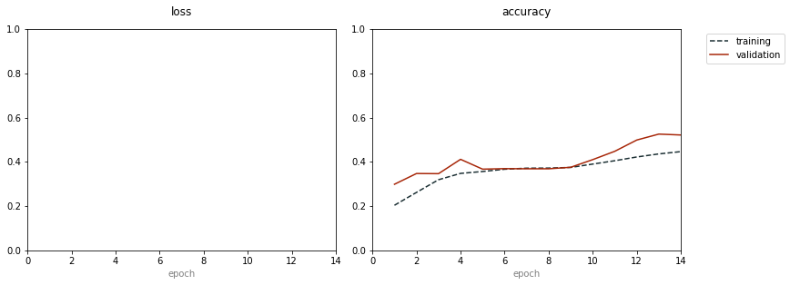
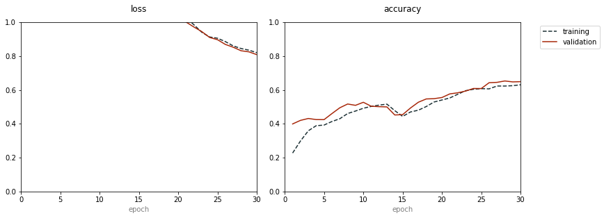
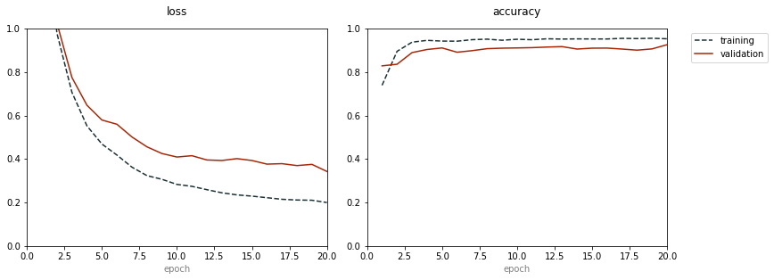

<ul><h1>Aim:</h1></ul><br/>
The aim of the project is to use data collected from mobile gyroscome and accelerometers and build a sequence model using LSTM's to classify the type of activity being performed by a human being within a given interval.<br/>
<br/>
<ul><h1> Description of the dataset: </h1></ul><br/>

This project was performed with the help of data obtained from UC Irvine dataset. 


The experiments have been carried out with a group of 30 volunteers within an age bracket of 19-48 years. Each person performed six activities (WALKING, WALKING_UPSTAIRS, WALKING_DOWNSTAIRS, SITTING, STANDING, LAYING) wearing a smartphone (Samsung Galaxy S II) on the waist. Using its embedded accelerometer and gyroscope, we captured 3-axial linear acceleration and 3-axial angular velocity at a constant rate of 50Hz. The experiments have been video-recorded to label the data manually. The obtained dataset has been randomly partitioned into two sets, where 70% of the volunteers was selected for generating the training data and 30% the test data. 

The sensor signals (accelerometer and gyroscope) were pre-processed by applying noise filters and then sampled in fixed-width sliding windows of 2.56 sec and 50% overlap (128 readings/window). The sensor acceleration signal, which has gravitational and body motion components, was separated using a Butterworth low-pass filter into body acceleration and gravity. The gravitational force is assumed to have only low frequency components, therefore a filter with 0.3 Hz cutoff frequency was used. From each window, a vector of features was obtained by calculating variables from the time and frequency domain. See 'features_info.txt' for more details. 

<ul><h1> Labels: </h1></ul><br/>
The labels folder which is y_train.txt and y_test has 6 different labels and they are as follows:<br/>
1 WALKING<br/>
2 WALKING_UPSTAIRS<br/>
3 WALKING_DOWNSTAIRS<br/>
4 SITTING<br/>
5 STANDING<br/>
6 LAYING<br/>


      File "<ipython-input-1-4b35a82b09bc>", line 1
        <ul><h1>Aim:</h1></ul><br/>
        ^
    SyntaxError: invalid syntax


## Importing the libraries that are necessary


```python
import pandas as pd
import numpy as np
import keras
from keras.models import Sequential
from keras.layers import LSTM,Dense,Dropout,Conv2D,MaxPooling2D,Flatten,BatchNormalization
import talos
```


```python
a=pd.read_csv("HAR/UCI_HAR_Dataset/train/Inertial Signals/body_acc_x_train.txt", delim_whitespace=True, header=None)
a.shape
```


    (7352, 128)


```python
SIGNALS = [
    "body_acc_x",
    "body_acc_y",
    "body_acc_z",
    "body_gyro_x",
    "body_gyro_y",
    "body_gyro_z",
    "total_acc_x",
    "total_acc_y",
    "total_acc_z"
]

```

## Some basic facts:

<h3> We have 7352 training samples and each of them have 128 time step with 9 inputs at each time step. Hence we have to write a function to get our data into 7352 rows with each row having 128 vectors of size 9. Basically of shape (7352,128,9).</h3>


```python
def load_data(subset):
    loaded_samples=[]
    for i in SIGNALS:
        
        f=pd.read_csv(f'HAR/UCI_HAR_Dataset/{subset}/Inertial Signals/{i}_{subset}.txt', delim_whitespace=True, header=None)
        loaded_samples.append(f.values)
    return np.transpose(loaded_samples,(1,2,0))
```


```python
def load_labels(subset):
    f=pd.read_csv(f'HAR/UCI_HAR_Dataset/{subset}/y_{subset}.txt', delim_whitespace=True, header=None)
    return pd.get_dummies(f[0]).values
    
```


```python
def load_datasets():
    x_train,x_test,y_train,y_test=load_data('train'),load_data('test'),load_labels('train'),load_labels('test')
    return x_train,x_test,y_train,y_test
```

## Loading the datasets:


```python
x_train,x_test,y_train,y_test=load_datasets()
```

## LSTM Model-1


```python
def recognize_human_activity(x_train, y_train, x_val, y_val, params):

    model=Sequential()
    model.add(LSTM(params['first_layer'],input_shape=(128,9),return_sequences=True))
    model.add(Dropout(params['drop_out_1']))
    model.add(LSTM(params['second_layer']))
    model.add(Dropout(params['drop_out_2']))
    model.add(Dense(params['dense'],activation="relu"))
    model.add(Dropout(params['drop_out_3']))
    model.add(Dense(6,activation="softmax"))
    model.compile(metrics=["accuracy"],optimizer="adam",loss="categorical_crossentropy")
    history=model.fit(x_train, y_train,validation_data=[x_val, y_val],batch_size=params['batch_size'],epochs=params['epochs'],callbacks=[talos.utils.live()])
    return history,model
```

## Hyperparameter tuning using Talos library


```python
params={'first_layer':[8,16,32,64],
        'second_layer':[8,16,32,64],
       'drop_out_1':[0.3,0.5,0.7],
       'drop_out_2':[0.3,0.5,0.7],
       'drop_out_3':[0.3,0.5,0.7],
       'dense':[16,32,64,100],
       'optimizer':["adam","adagrad"],
       'batch_size':[64,128,512,1024],
       'epochs':[8,10,12,14]}

```


```python
scan_object = talos.Scan(x_train,
                         y_train,
                         x_val=x_test,
                         y_val=y_test,
                         val_split=0.15 ,
                         params=params,
                         model=recognize_human_activity,
                         experiment_name='HAR',
                         round_limit=10)
```





    
    
    
    
    100%|██████████| 10/10 [12:09<00:00, 72.95s/it]


```python
scan_object.details

```


    experiment_name                     HAR
    random_method          uniform_mersenne
    reduction_method                   None
    reduction_interval                   50
    reduction_window                     20
    reduction_threshold                 0.2
    reduction_metric                val_acc
    complete_time            05/01/20/07:47
    x_shape                  (7352, 128, 9)
    y_shape                       (7352, 6)
    dtype: object


```python
analyze_object.data

```


<div>
<style scoped>
    .dataframe tbody tr th:only-of-type {
        vertical-align: middle;
    }

    .dataframe tbody tr th {
        vertical-align: top;
    }

    .dataframe thead th {
        text-align: right;
    }
</style>
<table border="1" class="dataframe">
  <thead>
    <tr style="text-align: right;">
      <th></th>
      <th>round_epochs</th>
      <th>val_loss</th>
      <th>val_accuracy</th>
      <th>loss</th>
      <th>accuracy</th>
      <th>batch_size</th>
      <th>dense</th>
      <th>drop_out_1</th>
      <th>drop_out_2</th>
      <th>drop_out_3</th>
      <th>epochs</th>
      <th>first_layer</th>
      <th>optimizer</th>
      <th>second_layer</th>
    </tr>
  </thead>
  <tbody>
    <tr>
      <th>0</th>
      <td>10</td>
      <td>1.027707</td>
      <td>0.556159</td>
      <td>1.086811</td>
      <td>0.528292</td>
      <td>512</td>
      <td>64</td>
      <td>0.3</td>
      <td>0.5</td>
      <td>0.7</td>
      <td>10</td>
      <td>8</td>
      <td>adam</td>
      <td>32</td>
    </tr>
    <tr>
      <th>1</th>
      <td>14</td>
      <td>0.784109</td>
      <td>0.671530</td>
      <td>0.653803</td>
      <td>0.709467</td>
      <td>512</td>
      <td>100</td>
      <td>0.3</td>
      <td>0.5</td>
      <td>0.7</td>
      <td>14</td>
      <td>8</td>
      <td>adam</td>
      <td>64</td>
    </tr>
    <tr>
      <th>2</th>
      <td>12</td>
      <td>0.901588</td>
      <td>0.621988</td>
      <td>1.065312</td>
      <td>0.561752</td>
      <td>1024</td>
      <td>32</td>
      <td>0.5</td>
      <td>0.7</td>
      <td>0.5</td>
      <td>12</td>
      <td>64</td>
      <td>adagrad</td>
      <td>32</td>
    </tr>
    <tr>
      <th>3</th>
      <td>12</td>
      <td>1.042917</td>
      <td>0.635901</td>
      <td>1.228112</td>
      <td>0.462731</td>
      <td>512</td>
      <td>64</td>
      <td>0.5</td>
      <td>0.7</td>
      <td>0.7</td>
      <td>12</td>
      <td>64</td>
      <td>adam</td>
      <td>8</td>
    </tr>
    <tr>
      <th>4</th>
      <td>8</td>
      <td>0.843970</td>
      <td>0.594503</td>
      <td>0.917788</td>
      <td>0.539309</td>
      <td>128</td>
      <td>32</td>
      <td>0.5</td>
      <td>0.3</td>
      <td>0.3</td>
      <td>8</td>
      <td>16</td>
      <td>adam</td>
      <td>8</td>
    </tr>
    <tr>
      <th>5</th>
      <td>14</td>
      <td>1.022163</td>
      <td>0.554462</td>
      <td>0.977557</td>
      <td>0.586099</td>
      <td>1024</td>
      <td>100</td>
      <td>0.5</td>
      <td>0.5</td>
      <td>0.7</td>
      <td>14</td>
      <td>8</td>
      <td>adam</td>
      <td>64</td>
    </tr>
    <tr>
      <th>6</th>
      <td>8</td>
      <td>0.966695</td>
      <td>0.582966</td>
      <td>1.080585</td>
      <td>0.539037</td>
      <td>1024</td>
      <td>64</td>
      <td>0.5</td>
      <td>0.7</td>
      <td>0.5</td>
      <td>8</td>
      <td>64</td>
      <td>adam</td>
      <td>64</td>
    </tr>
    <tr>
      <th>7</th>
      <td>12</td>
      <td>0.887921</td>
      <td>0.643705</td>
      <td>1.007619</td>
      <td>0.584875</td>
      <td>512</td>
      <td>32</td>
      <td>0.3</td>
      <td>0.5</td>
      <td>0.3</td>
      <td>12</td>
      <td>64</td>
      <td>adagrad</td>
      <td>8</td>
    </tr>
    <tr>
      <th>8</th>
      <td>8</td>
      <td>1.060376</td>
      <td>0.593485</td>
      <td>1.129201</td>
      <td>0.540125</td>
      <td>1024</td>
      <td>32</td>
      <td>0.3</td>
      <td>0.3</td>
      <td>0.7</td>
      <td>8</td>
      <td>64</td>
      <td>adagrad</td>
      <td>64</td>
    </tr>
    <tr>
      <th>9</th>
      <td>14</td>
      <td>1.230504</td>
      <td>0.521208</td>
      <td>1.286050</td>
      <td>0.446137</td>
      <td>1024</td>
      <td>32</td>
      <td>0.7</td>
      <td>0.3</td>
      <td>0.5</td>
      <td>14</td>
      <td>8</td>
      <td>adam</td>
      <td>16</td>
    </tr>
  </tbody>
</table>
</div>


## From the above table we can see that none of the models perform upto the mark.


```python
def recognize_human_activity_model_2(x_train, y_train, x_val, y_val, params):

    model=Sequential()
    model.add(LSTM(params['first_layer'],input_shape=(128,9)))
    model.add(Dropout(params['drop_out_1']))
    
    model.add(Dense(6,activation="softmax"))
    model.compile(metrics=["accuracy"],optimizer="adam",loss="categorical_crossentropy")
    history=model.fit(x_train, y_train,validation_data=[x_val, y_val],batch_size=params['batch_size'],epochs=params['epochs'],callbacks=[talos.utils.live()])
    return history,model
```


```python
params={'first_layer':[8,16,32,64],
        'second_layer':[8,16,32,64],
       'drop_out_1':[0.3,0.5,0.7],
       'drop_out_2':[0.3,0.5,0.7],
       'drop_out_3':[0.3,0.5,0.7],
       'dense':[16,32,64,100],
       'optimizer':["adam","adagrad"],
       'batch_size':[64,128,512,1024],
       'epochs':[15,20,30,40]}

```


```python
x_train,x_test,y_train,y_test=load_datasets()
scan_object = talos.Scan(x_train,
                         y_train,
                         x_val=x_test,
                         y_val=y_test,
                         params=params,
                         model=recognize_human_activity_model_2,
                         experiment_name='HAR',
                         round_limit=10)
```





    
    
    
    
    
    
    
    
    100%|██████████| 10/10 [20:21<00:00, 122.16s/it]


```python

```


```python
analyze_object = talos.Analyze(scan_object)
analyze_object.data
```


<div>
<style scoped>
    .dataframe tbody tr th:only-of-type {
        vertical-align: middle;
    }

    .dataframe tbody tr th {
        vertical-align: top;
    }

    .dataframe thead th {
        text-align: right;
    }
</style>
<table border="1" class="dataframe">
  <thead>
    <tr style="text-align: right;">
      <th></th>
      <th>round_epochs</th>
      <th>val_loss</th>
      <th>val_accuracy</th>
      <th>loss</th>
      <th>accuracy</th>
      <th>batch_size</th>
      <th>dense</th>
      <th>drop_out_1</th>
      <th>drop_out_2</th>
      <th>drop_out_3</th>
      <th>epochs</th>
      <th>first_layer</th>
      <th>optimizer</th>
      <th>second_layer</th>
    </tr>
  </thead>
  <tbody>
    <tr>
      <th>0</th>
      <td>15</td>
      <td>0.411475</td>
      <td>0.860875</td>
      <td>0.313300</td>
      <td>0.913357</td>
      <td>128</td>
      <td>64</td>
      <td>0.7</td>
      <td>0.5</td>
      <td>0.3</td>
      <td>15</td>
      <td>64</td>
      <td>adagrad</td>
      <td>16</td>
    </tr>
    <tr>
      <th>1</th>
      <td>15</td>
      <td>1.408659</td>
      <td>0.653546</td>
      <td>0.580935</td>
      <td>0.784684</td>
      <td>128</td>
      <td>16</td>
      <td>0.7</td>
      <td>0.5</td>
      <td>0.5</td>
      <td>15</td>
      <td>32</td>
      <td>adam</td>
      <td>32</td>
    </tr>
    <tr>
      <th>2</th>
      <td>20</td>
      <td>0.352916</td>
      <td>0.882932</td>
      <td>0.145438</td>
      <td>0.943145</td>
      <td>128</td>
      <td>64</td>
      <td>0.3</td>
      <td>0.3</td>
      <td>0.5</td>
      <td>20</td>
      <td>64</td>
      <td>adam</td>
      <td>16</td>
    </tr>
    <tr>
      <th>3</th>
      <td>40</td>
      <td>0.435675</td>
      <td>0.865287</td>
      <td>0.243220</td>
      <td>0.926959</td>
      <td>1024</td>
      <td>32</td>
      <td>0.5</td>
      <td>0.5</td>
      <td>0.7</td>
      <td>40</td>
      <td>64</td>
      <td>adam</td>
      <td>16</td>
    </tr>
    <tr>
      <th>4</th>
      <td>30</td>
      <td>0.784642</td>
      <td>0.632508</td>
      <td>0.760306</td>
      <td>0.649075</td>
      <td>1024</td>
      <td>100</td>
      <td>0.3</td>
      <td>0.5</td>
      <td>0.7</td>
      <td>30</td>
      <td>16</td>
      <td>adam</td>
      <td>64</td>
    </tr>
    <tr>
      <th>5</th>
      <td>15</td>
      <td>0.957987</td>
      <td>0.599932</td>
      <td>0.583941</td>
      <td>0.769995</td>
      <td>512</td>
      <td>100</td>
      <td>0.7</td>
      <td>0.7</td>
      <td>0.5</td>
      <td>15</td>
      <td>64</td>
      <td>adam</td>
      <td>32</td>
    </tr>
    <tr>
      <th>6</th>
      <td>30</td>
      <td>0.358834</td>
      <td>0.888700</td>
      <td>0.215881</td>
      <td>0.930631</td>
      <td>128</td>
      <td>16</td>
      <td>0.3</td>
      <td>0.3</td>
      <td>0.7</td>
      <td>30</td>
      <td>32</td>
      <td>adam</td>
      <td>16</td>
    </tr>
    <tr>
      <th>7</th>
      <td>15</td>
      <td>0.656953</td>
      <td>0.759077</td>
      <td>0.449310</td>
      <td>0.840860</td>
      <td>128</td>
      <td>32</td>
      <td>0.3</td>
      <td>0.3</td>
      <td>0.5</td>
      <td>15</td>
      <td>64</td>
      <td>adam</td>
      <td>64</td>
    </tr>
    <tr>
      <th>8</th>
      <td>20</td>
      <td>0.533722</td>
      <td>0.821853</td>
      <td>0.487310</td>
      <td>0.830250</td>
      <td>128</td>
      <td>100</td>
      <td>0.7</td>
      <td>0.5</td>
      <td>0.5</td>
      <td>20</td>
      <td>64</td>
      <td>adam</td>
      <td>16</td>
    </tr>
    <tr>
      <th>9</th>
      <td>30</td>
      <td>0.808433</td>
      <td>0.648795</td>
      <td>0.820271</td>
      <td>0.630305</td>
      <td>1024</td>
      <td>100</td>
      <td>0.7</td>
      <td>0.7</td>
      <td>0.5</td>
      <td>30</td>
      <td>32</td>
      <td>adagrad</td>
      <td>32</td>
    </tr>
  </tbody>
</table>
</div>


## Even in the above we can see that none of the models give the desired accuracy.

## Hence we are going to try CNN based models

## Reshaping the data so that it can be fed as input to CNN:


```python
x_train,x_test,y_train,y_test=load_datasets()
x_train=x_train.reshape(x_train.shape[0],x_train.shape[1],x_train.shape[2],1)
x_test=x_test.reshape(x_test.shape[0],x_test.shape[1],x_test.shape[2],1)
```

## CNN MODEL-1


```python
def model_cnn(x_train,y_train,x_val,y_val,params):
    model=Sequential()
    model.add(Conv2D(filters=params['filters'],kernel_size=params['kernel_size'],kernel_regularizer="l2",activation="relu",kernel_initializer=params['initializer']))
    model.add(Conv2D(filters=params['filters'],kernel_size=params['kernel_size'],kernel_regularizer="l2",activation="relu",kernel_initializer=params['initializer']))
    model.add(MaxPooling2D(pool_size=params["max_pool"], strides=None, padding='same', data_format='channels_last'))
    model.add(Flatten())
    model.add(Dense(6,activation="softmax"))
    model.compile(metrics=["accuracy"],optimizer="adam",loss="categorical_crossentropy")
    history=model.fit(x_train, y_train,validation_data=[x_val, y_val],batch_size=params['batch_size'],epochs=params['epochs'],callbacks=[talos.utils.live()])
    return history,model
```


```python
params={'filters':[16,32,64,96],
       'kernel_size':[(2,2),(3,3),(5,5)],
       'initializer':['he_normal','glorot_normal'],
       'max_pool':[(2,2),(3,3),(5,5)],
       'batch_size':[64,128,512,1024],
       'epochs':[15,20,30,40,50,60]
       }
```


```python
scan_object_cnn = talos.Scan(x_train,
                         y_train,
                         x_val=x_test,
                         y_val=y_test,
                         params=params,
                         model=model_cnn,
                         experiment_name='HAR',
                         round_limit=10)
```





    
    
    
    
    
    100%|██████████| 10/10 [30:00<00:00, 180.09s/it]


```python
## Above we see the accuracy going up with epochs in the learning curve for the choosen model
```


```python
analyze_object = talos.Analyze(scan_object_cnn)
analyze_object.data
```


<div>
<style scoped>
    .dataframe tbody tr th:only-of-type {
        vertical-align: middle;
    }

    .dataframe tbody tr th {
        vertical-align: top;
    }

    .dataframe thead th {
        text-align: right;
    }
</style>
<table border="1" class="dataframe">
  <thead>
    <tr style="text-align: right;">
      <th></th>
      <th>round_epochs</th>
      <th>val_loss</th>
      <th>val_accuracy</th>
      <th>loss</th>
      <th>accuracy</th>
      <th>batch_size</th>
      <th>epochs</th>
      <th>filters</th>
      <th>initializer</th>
      <th>kernel_size</th>
      <th>max_pool</th>
    </tr>
  </thead>
  <tbody>
    <tr>
      <th>0</th>
      <td>30</td>
      <td>0.490238</td>
      <td>0.890058</td>
      <td>0.291800</td>
      <td>0.958107</td>
      <td>128</td>
      <td>30</td>
      <td>32</td>
      <td>he_normal</td>
      <td>(2, 2)</td>
      <td>(3, 3)</td>
    </tr>
    <tr>
      <th>1</th>
      <td>40</td>
      <td>0.453825</td>
      <td>0.861893</td>
      <td>0.196400</td>
      <td>0.961099</td>
      <td>128</td>
      <td>40</td>
      <td>16</td>
      <td>glorot_normal</td>
      <td>(2, 2)</td>
      <td>(2, 2)</td>
    </tr>
    <tr>
      <th>2</th>
      <td>30</td>
      <td>0.410041</td>
      <td>0.896166</td>
      <td>0.229350</td>
      <td>0.952258</td>
      <td>512</td>
      <td>30</td>
      <td>64</td>
      <td>glorot_normal</td>
      <td>(3, 3)</td>
      <td>(3, 3)</td>
    </tr>
    <tr>
      <th>3</th>
      <td>60</td>
      <td>0.491944</td>
      <td>0.898202</td>
      <td>0.364003</td>
      <td>0.953482</td>
      <td>1024</td>
      <td>60</td>
      <td>64</td>
      <td>he_normal</td>
      <td>(5, 5)</td>
      <td>(5, 5)</td>
    </tr>
    <tr>
      <th>4</th>
      <td>15</td>
      <td>0.718064</td>
      <td>0.785545</td>
      <td>0.476414</td>
      <td>0.886289</td>
      <td>1024</td>
      <td>15</td>
      <td>32</td>
      <td>glorot_normal</td>
      <td>(2, 2)</td>
      <td>(2, 2)</td>
    </tr>
    <tr>
      <th>5</th>
      <td>30</td>
      <td>0.621700</td>
      <td>0.874109</td>
      <td>0.440351</td>
      <td>0.948857</td>
      <td>512</td>
      <td>30</td>
      <td>96</td>
      <td>he_normal</td>
      <td>(5, 5)</td>
      <td>(3, 3)</td>
    </tr>
    <tr>
      <th>6</th>
      <td>60</td>
      <td>0.351684</td>
      <td>0.910078</td>
      <td>0.125883</td>
      <td>0.961779</td>
      <td>64</td>
      <td>60</td>
      <td>32</td>
      <td>he_normal</td>
      <td>(5, 5)</td>
      <td>(2, 2)</td>
    </tr>
    <tr>
      <th>7</th>
      <td>15</td>
      <td>0.903348</td>
      <td>0.890058</td>
      <td>0.776603</td>
      <td>0.952122</td>
      <td>512</td>
      <td>15</td>
      <td>64</td>
      <td>he_normal</td>
      <td>(5, 5)</td>
      <td>(3, 3)</td>
    </tr>
    <tr>
      <th>8</th>
      <td>20</td>
      <td>0.384136</td>
      <td>0.894808</td>
      <td>0.232845</td>
      <td>0.951442</td>
      <td>128</td>
      <td>20</td>
      <td>96</td>
      <td>he_normal</td>
      <td>(5, 5)</td>
      <td>(2, 2)</td>
    </tr>
    <tr>
      <th>9</th>
      <td>20</td>
      <td>0.342566</td>
      <td>0.925687</td>
      <td>0.199633</td>
      <td>0.952802</td>
      <td>64</td>
      <td>20</td>
      <td>32</td>
      <td>he_normal</td>
      <td>(5, 5)</td>
      <td>(5, 5)</td>
    </tr>
  </tbody>
</table>
</div>


## We observe above that the last model which we trained with 20 epochs have a validation accuracy of 92.5% and a train accuracy of 95.2%

## In this model we have used CNN rather than a LSTM to make it work. This seems to have achieved the objerctive of the assignment.

## Conclusions:


```python
from prettytable import PrettyTable
```


```python
x=PrettyTable(["Model","Description of the Model","Train Accuracy","Test Accuracy"])
x.add_row(["LSTM Model-1\n\n","LSTM+dropout+LSTM+dropout+Dense+dropout+softmax+adagrad\n\n","70%\n\n","67%\n\n"])
x.add_row(["LSTM Model-2\n\n","LSTM+dropout+softmax+adam\n\n","94%\n\n","88%\n\n"])
x.add_row(["CNN MODEL-1\n\n","CONV+CONV+MAXPOOL+FLATTEN+DENSE+ADAM\n\n","95%\n\n","92%\n\n"])
print(x)
```

    +--------------+---------------------------------------------------------+----------------+---------------+
    |    Model     |                 Description of the Model                | Train Accuracy | Test Accuracy |
    +--------------+---------------------------------------------------------+----------------+---------------+
    | LSTM Model-1 | LSTM+dropout+LSTM+dropout+Dense+dropout+softmax+adagrad |      70%       |      67%      |
    |              |                                                         |                |               |
    |              |                                                         |                |               |
    | LSTM Model-2 |                LSTM+dropout+softmax+adam                |      94%       |      88%      |
    |              |                                                         |                |               |
    |              |                                                         |                |               |
    | CNN MODEL-1  |           CONV+CONV+MAXPOOL+FLATTEN+DENSE+ADAM          |      95%       |      92%      |
    |              |                                                         |                |               |
    |              |                                                         |                |               |
    +--------------+---------------------------------------------------------+----------------+---------------+


<b> We observe that CNN based model did better than the LSTM models though the LSTM Models were expected to do better.</b>
