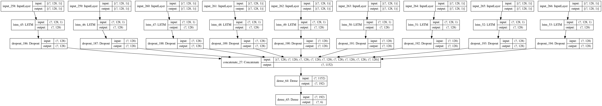

<ul><h1>Aim:</h1></ul><br/>
The aim of the project is to use data collected from mobile gyroscome and accelerometers and build a sequence model using LSTM's to classify the type of activity being performed by a human being within a given interval.<br/>
<br/>
<ul><h1> Description of the dataset: </h1></ul><br/>

This project was performed with the help of data obtained from UC Irvine dataset. 


The experiments have been carried out with a group of 30 volunteers within an age bracket of 19-48 years. Each person performed six activities (WALKING, WALKING_UPSTAIRS, WALKING_DOWNSTAIRS, SITTING, STANDING, LAYING) wearing a smartphone (Samsung Galaxy S II) on the waist. Using its embedded accelerometer and gyroscope, we captured 3-axial linear acceleration and 3-axial angular velocity at a constant rate of 50Hz. The experiments have been video-recorded to label the data manually. The obtained dataset has been randomly partitioned into two sets, where 70% of the volunteers was selected for generating the training data and 30% the test data. 

The sensor signals (accelerometer and gyroscope) were pre-processed by applying noise filters and then sampled in fixed-width sliding windows of 2.56 sec and 50% overlap (128 readings/window). The sensor acceleration signal, which has gravitational and body motion components, was separated using a Butterworth low-pass filter into body acceleration and gravity. The gravitational force is assumed to have only low frequency components, therefore a filter with 0.3 Hz cutoff frequency was used. From each window, a vector of features was obtained by calculating variables from the time and frequency domain. See 'features_info.txt' for more details. 

<ul><h1> Labels: </h1></ul><br/>
The labels folder which is y_train.txt and y_test has 6 different labels and they are as follows:<br/>
1 WALKING<br/>
2 WALKING_UPSTAIRS<br/>
3 WALKING_DOWNSTAIRS<br/>
4 SITTING<br/>
5 STANDING<br/>
6 LAYING<br/>


```python
Image(filename = "activity.png", width=1000, height=600)
```


## DESCRIPTION OF THE SOLUTION:

A CNN based divide and conquer model seemed to work best. The 9 different readings collected form the sensor were pased as inputs to  a 1D CNN which gave a very well performing model. 

## Importing the libraries that are necessary


```python
import pandas as pd
import numpy as np
import tensorflow as tf
from tensorflow import keras
import matplotlib.pyplot as plt
import os
import datetime
from prettytable import PrettyTable
from IPython.display import Image
from IPython.core.display import HTML 
```


```python
SIGNALS = [
    "body_acc_x",
    "body_acc_y",
    "body_acc_z",
    "body_gyro_x",
    "body_gyro_y",
    "body_gyro_z",
    "total_acc_x",
    "total_acc_y",
    "total_acc_z"
]
```

## Some basic facts about the dataset

<h3> We have 7352 training samples and each of them have 128 time step with 9 inputs at each time step. Hence we have to write a function to get our data into 7352 rows with each row having 128 vectors of size 9. Basically of shape (7352,128,9).</h3>

## Functions to load the dataset:


```python
def load_data(subset):
    loaded_samples=[]
    for i in SIGNALS:
        
        f=pd.read_csv(f'HAR/UCI_HAR_Dataset/{subset}/Inertial Signals/{i}_{subset}.txt', delim_whitespace=True, header=None)
        loaded_samples.append(f.values)
    return np.transpose(loaded_samples,(1,2,0))
```


```python
def load_labels(subset):
    f=pd.read_csv(f'HAR/UCI_HAR_Dataset/{subset}/y_{subset}.txt', delim_whitespace=True, header=None)
    return pd.get_dummies(f[0]).values
```


```python
def load_datasets():
    x_train,x_test,y_train,y_test=load_data('train'),load_data('test'),load_labels('train'),load_labels('test')
    return x_train,x_test,y_train,y_test
```


```python
import matplotlib.pyplot as plt
import numpy as np
import time

def plt_dynamic(x, vy, ty, ax, colors=['b']):
    ax.plot(x, vy, 'b', label="Validation Loss")
    ax.plot(x, ty, 'r', label="Train Loss")
    plt.legend()
    plt.grid()
    fig.canvas.draw()
```

## Loading the datasets:


```python
x_train,x_test,y_train,y_test=load_datasets()
```

## LSTM based model:


```python
def lstm_model_1():
    inputs=keras.Input(shape=(128,9))
    o1=keras.layers.LSTM(128,input_shape=(128,9),return_sequences=True)(inputs)
    o2=keras.layers.Dropout(0.5)(o1)
    o3=keras.layers.LSTM(128)(o2)
    o4=keras.layers.Dropout(0.5)(o3)
    o5=keras.layers.Dense(6,activation="softmax")(o4)
    model=keras.Model(inputs,o5)
    model.compile(optimizer="adam",metrics=["accuracy"],loss="categorical_crossentropy")
    return model
```


```python
model_object=lstm_model_1()
```


```python
model_object.summary()
```

    Model: "model_3"
    _________________________________________________________________
    Layer (type)                 Output Shape              Param #   
    =================================================================
    input_5 (InputLayer)         [(None, 128, 9)]          0         
    _________________________________________________________________
    lstm_7 (LSTM)                (None, 128, 128)          70656     
    _________________________________________________________________
    dropout_9 (Dropout)          (None, 128, 128)          0         
    _________________________________________________________________
    lstm_8 (LSTM)                (None, 128)               131584    
    _________________________________________________________________
    dropout_10 (Dropout)         (None, 128)               0         
    _________________________________________________________________
    dense_12 (Dense)             (None, 6)                 774       
    =================================================================
    Total params: 203,014
    Trainable params: 203,014
    Non-trainable params: 0
    _________________________________________________________________


```python
keras.utils.plot_model(model_object,'lstm_model_1.png',show_shapes=True)
```


```python
model_object.fit(x_train,y_train,batch_size=512,epochs=30,validation_data=(x_test,y_test))
```

## LSTM MODEL BASED DIVIDE AND CONQUER MODEL


```python
def lstm_model_2():
    input_1=keras.Input(shape=(128,1))
    o1=keras.layers.LSTM(128,input_shape=(128,1))(input_1)
    o2=keras.layers.Dropout(0.5)(o1)
    input_2=keras.Input(shape=(128,1))
    o3=keras.layers.LSTM(128,input_shape=(128,1))(input_2)
    o4=keras.layers.Dropout(0.5)(o3)
    input_3=keras.Input(shape=(128,1))
    o5=keras.layers.LSTM(128,input_shape=(128,1))(input_3)
    o6=keras.layers.Dropout(0.5)(o5)
    input_4=keras.Input(shape=(128,1))
    o7=keras.layers.LSTM(128,input_shape=(128,1))(input_4)
    o8=keras.layers.Dropout(0.5)(o7)
    
    input_5=keras.Input(shape=(128,1))
    o9=keras.layers.LSTM(128,input_shape=(128,1))(input_5)
    o10=keras.layers.Dropout(0.5)(o9)
    input_6=keras.Input(shape=(128,1))
    o11=keras.layers.LSTM(128,input_shape=(128,1))(input_6)
    o12=keras.layers.Dropout(0.5)(o11)
    input_7=keras.Input(shape=(128,1))
    o13=keras.layers.LSTM(128,input_shape=(128,1))(input_7)
    o14=keras.layers.Dropout(0.5)(o13)
    input_8=keras.Input(shape=(128,1))
    o15=keras.layers.LSTM(128,input_shape=(128,1))(input_8)
    o16=keras.layers.Dropout(0.5)(o15)
    input_9=keras.Input(shape=(128,1))
    o17=keras.layers.LSTM(128,input_shape=(128,1))(input_9)
    o18=keras.layers.Dropout(0.5)(o17)
    outputTensor = keras.layers.Concatenate(axis=1)([o2,o4,o6,o8,o10,o12,o14,o16,o18])
    o20=keras.layers.Dense(192)(outputTensor)
    o21=keras.layers.Dense(6,activation="softmax")(o20)
    model=keras.Model([input_1,input_2,input_3,input_4,input_5,input_6,input_7,input_8,input_9],o21)
    model.compile(optimizer="adam",metrics=["accuracy"],loss="categorical_crossentropy")
    return model
```


```python
model_object_2=lstm_model_2()
```


```python
keras.utils.plot_model(model_object_2,'lstm_model_2.png',show_shapes=True)
```





```python
x_divide_train=np.expand_dims(np.transpose(x_train,(2,0,1)),3)
x_divide_test=np.expand_dims(np.transpose(x_test,(2,0,1)),3)
```


```python
lstm_div_2=model_object_2.fit([x_divide_train[0],x_divide_train[1],x_divide_train[2],x_divide_train[3],x_divide_train[4],x_divide_train[5],x_divide_train[6],x_divide_train[7],x_divide_train[8]],y_train,batch_size=512,epochs=60,validation_data=([x_divide_test[0],x_divide_test[1],x_divide_test[2],x_divide_test[3],x_divide_test[4],x_divide_test[5],x_divide_test[6],x_divide_test[7],x_divide_test[8]],y_test))


```


```python
fig,ax = plt.subplots(1,1)
ax.set_xlabel('epoch') 
ax.set_ylabel('Categorical Crossentropy Loss')
x = list(range(1,60+1))
vy = lstm_div_2.history['val_loss']
ty = lstm_div_2.history['loss']
plt_dynamic(x, vy, ty, ax)
```


## CNN BASED DIVIDE AND CONQUER MODEL


```python
def conv_model_1():
    input_1=keras.Input(shape=(128,1))
    o1=keras.layers.Conv1D(10,3,input_shape=(128,1),activation="relu")(input_1)
    input_2=keras.Input(shape=(128,1))
    o3=keras.layers.Conv1D(10,3,input_shape=(128,1),activation="relu")(input_2)
    input_3=keras.Input(shape=(128,1))
    o5=keras.layers.Conv1D(10,3,input_shape=(128,1),activation="relu")(input_3)
    input_4=keras.Input(shape=(128,1))
    o7=keras.layers.Conv1D(10,3,input_shape=(128,1),activation="relu")(input_4)
    
    input_5=keras.Input(shape=(128,1))
    o9=keras.layers.Conv1D(10,3,input_shape=(128,1),activation="relu")(input_5)
    input_6=keras.Input(shape=(128,1))
    o11=keras.layers.Conv1D(10,3,input_shape=(128,1),activation="relu")(input_6)
    input_7=keras.Input(shape=(128,1))
    o13=keras.layers.Conv1D(10,3,input_shape=(128,1),activation="relu")(input_7)
    input_8=keras.Input(shape=(128,1))
    o15=keras.layers.Conv1D(10,3,input_shape=(128,1),activation="relu")(input_8)
    input_9=keras.Input(shape=(128,1))
    o17=keras.layers.Conv1D(10,3,input_shape=(128,1),activation="relu")(input_9)
    
    
    outputTensor = keras.layers.Concatenate(axis=1)([o1,o3,o5,o7,o9,o11,o13,o15,o17])
    d2d=keras.layers.Dropout(0.5)(outputTensor)
    outy=keras.layers.Flatten()(d2d)
    obatch=keras.layers.BatchNormalization()(outy)
    o20=keras.layers.Dense(192,activation=tf.nn.relu)(obatch)
    o21=keras.layers.Dropout(0.5)(o20)
    o25=keras.layers.Dense(6,activation="softmax")(o21)
    
    model=keras.Model([input_1,input_2,input_3,input_4,input_5,input_6,input_7,input_8,input_9],o25)
    model.compile(optimizer="adam",metrics=["accuracy"],loss="categorical_crossentropy")
    return model
```


```python
model_conv_1_object=conv_model_1()
```


```python
model_conv_1_object.summary()
```

    Model: "model_23"
    __________________________________________________________________________________________________
    Layer (type)                    Output Shape         Param #     Connected to                     
    ==================================================================================================
    input_249 (InputLayer)          [(None, 128, 1)]     0                                            
    __________________________________________________________________________________________________
    input_250 (InputLayer)          [(None, 128, 1)]     0                                            
    __________________________________________________________________________________________________
    input_251 (InputLayer)          [(None, 128, 1)]     0                                            
    __________________________________________________________________________________________________
    input_252 (InputLayer)          [(None, 128, 1)]     0                                            
    __________________________________________________________________________________________________
    input_253 (InputLayer)          [(None, 128, 1)]     0                                            
    __________________________________________________________________________________________________
    input_254 (InputLayer)          [(None, 128, 1)]     0                                            
    __________________________________________________________________________________________________
    input_255 (InputLayer)          [(None, 128, 1)]     0                                            
    __________________________________________________________________________________________________
    input_256 (InputLayer)          [(None, 128, 1)]     0                                            
    __________________________________________________________________________________________________
    input_257 (InputLayer)          [(None, 128, 1)]     0                                            
    __________________________________________________________________________________________________
    conv1d_207 (Conv1D)             (None, 126, 10)      40          input_249[0][0]                  
    __________________________________________________________________________________________________
    conv1d_208 (Conv1D)             (None, 126, 10)      40          input_250[0][0]                  
    __________________________________________________________________________________________________
    conv1d_209 (Conv1D)             (None, 126, 10)      40          input_251[0][0]                  
    __________________________________________________________________________________________________
    conv1d_210 (Conv1D)             (None, 126, 10)      40          input_252[0][0]                  
    __________________________________________________________________________________________________
    conv1d_211 (Conv1D)             (None, 126, 10)      40          input_253[0][0]                  
    __________________________________________________________________________________________________
    conv1d_212 (Conv1D)             (None, 126, 10)      40          input_254[0][0]                  
    __________________________________________________________________________________________________
    conv1d_213 (Conv1D)             (None, 126, 10)      40          input_255[0][0]                  
    __________________________________________________________________________________________________
    conv1d_214 (Conv1D)             (None, 126, 10)      40          input_256[0][0]                  
    __________________________________________________________________________________________________
    conv1d_215 (Conv1D)             (None, 126, 10)      40          input_257[0][0]                  
    __________________________________________________________________________________________________
    concatenate_26 (Concatenate)    (None, 1134, 10)     0           conv1d_207[0][0]                 
                                                                     conv1d_208[0][0]                 
                                                                     conv1d_209[0][0]                 
                                                                     conv1d_210[0][0]                 
                                                                     conv1d_211[0][0]                 
                                                                     conv1d_212[0][0]                 
                                                                     conv1d_213[0][0]                 
                                                                     conv1d_214[0][0]                 
                                                                     conv1d_215[0][0]                 
    __________________________________________________________________________________________________
    dropout_184 (Dropout)           (None, 1134, 10)     0           concatenate_26[0][0]             
    __________________________________________________________________________________________________
    flatten_22 (Flatten)            (None, 11340)        0           dropout_184[0][0]                
    __________________________________________________________________________________________________
    batch_normalization_12 (BatchNo (None, 11340)        45360       flatten_22[0][0]                 
    __________________________________________________________________________________________________
    dense_62 (Dense)                (None, 192)          2177472     batch_normalization_12[0][0]     
    __________________________________________________________________________________________________
    dropout_185 (Dropout)           (None, 192)          0           dense_62[0][0]                   
    __________________________________________________________________________________________________
    dense_63 (Dense)                (None, 6)            1158        dropout_185[0][0]                
    ==================================================================================================
    Total params: 2,224,350
    Trainable params: 2,201,670
    Non-trainable params: 22,680
    __________________________________________________________________________________________________


```python
keras.utils.plot_model(model_conv_1_object,'conv_1_object.png',show_shapes=True)
```


```python
callback=tf.keras.callbacks.ModelCheckpoint(
    "model_weight", monitor='val_loss', verbose=0, save_best_only=True,
    save_weights_only=True, mode='auto', save_freq='epoch'
)
hist_cnn=model_conv_1_object.fit([x_divide_train[0],x_divide_train[1],x_divide_train[2],x_divide_train[3],x_divide_train[4]
                         ,x_divide_train[5],x_divide_train[6],x_divide_train[7],x_divide_train[8]],y_train,
                          batch_size=1024,epochs=60,validation_data=([x_divide_test[0],x_divide_test[1],
                                                                     x_divide_test[2],x_divide_test[3],x_divide_test[4],x_divide_test[5],x_divide_test[6],x_divide_test[7],
                                                                     x_divide_test[8]],y_test),callbacks=[callback])


```


```python
fig,ax = plt.subplots(1,1)
ax.set_xlabel('epoch') 
ax.set_ylabel('Categorical Crossentropy Loss')
x = list(range(1,60+1))
vy = hist_cnn.history['val_loss']
ty = hist_cnn.history['loss']
plt_dynamic(x, vy, ty, ax)
```


Conclusions:


```python
x=PrettyTable(["Model","Description of the Model","Train Accuracy","Test Accuracy"])
x.add_row(["LSTM\n\n","Basic approach\n\n","94.5%\n\n","90.7%\n\n"])
x.add_row(["LSTM\n\n","Divide and Conquer approach\n\n","95%\n\n","92%\n\n"])
x.add_row(["CNN\n\n","Divide and Conquer approach\n\n","96%\n\n","91.5%\n\n"])
print(x)
```

    +-------+-----------------------------+----------------+---------------+
    | Model |   Description of the Model  | Train Accuracy | Test Accuracy |
    +-------+-----------------------------+----------------+---------------+
    |  LSTM |        Basic approach       |     94.5%      |     90.7%     |
    |       |                             |                |               |
    |       |                             |                |               |
    |  LSTM | Divide and Conquer approach |      95%       |      92%      |
    |       |                             |                |               |
    |       |                             |                |               |
    |  CNN  | Divide and Conquer approach |      96%       |     91.5%     |
    |       |                             |                |               |
    |       |                             |                |               |
    +-------+-----------------------------+----------------+---------------+

